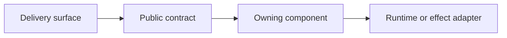

# Design Proposal: <Title>

**Tracking issue:** <link or Not created>

---

## 1. Background

Explain the user or system context, why this work is being considered now, and
the authoritative product requirements or accepted decisions. Link those
sources.

## 2. Problem

State the concrete gap in current behavior and its impact. Separate observed or
source-confirmed limitations from hypotheses.

## 3. Goals

- Describe measurable outcomes this design must achieve.

## 4. Non-Goals

- State adjacent work this proposal intentionally does not own.

## 5. Terminology and Constraints

Define ambiguous terms, invariants, compatibility constraints, platform
requirements, and decisions already made.

## 6. Current System and Evidence

Trace the production composition and request path. Name current owners, public
contracts, persisted state, and important failure behavior. Link exact source
files, tests, specifications, and runtime evidence.

Use an evidence table when useful:

| Claim | Evidence | Confidence |
| :--- | :--- | :--- |
| <current behavior> | <source, test, or run link> | Source-confirmed / Test-confirmed / Runtime-verified |

## 7. Proposed Design

### 7.1 User and Product Behavior

Describe the visible workflow, defaults, affordances, progress, errors,
cancellation, retries, and degraded behavior.

### 7.2 Architecture and Ownership

Name the owner of each policy, state transition, effect, and persisted record.
Show dependency direction and composition or selection boundaries.

Delete the diagram when it adds no information beyond the prose.

### 7.3 Contracts and Data

Specify proposed APIs, routes, commands, events, models, versioning, validation,
and redaction. Clearly distinguish new shapes from existing ones.

### 7.4 Lifecycle, State, and Concurrency

Describe ordering, state transitions, locks or serialization, idempotency,
interrupts, cancellation, shutdown, and restart/recovery behavior.

### 7.5 Failure Semantics

Cover validation failures, unavailable dependencies, partial success, retries,
timeouts, cleanup, and what remains active or persisted after each failure.

| Failure point | Caller result | Durable state | Recovery or retry |
| :--- | :--- | :--- | :--- |
| <failure> | <typed/public result> | <state after failure> | <next action> |

### 7.6 Compatibility and Migration

Describe coexistence, feature or process selection, old data or wire handling,
rollout ordering, fallback policy, and the removal condition for temporary
compatibility code.

### 7.7 Observability, Privacy, and Security

Specify logs, metrics, traces, redaction, credentials, permissions, trust
boundaries, and operator-visible convergence signals. State why no new signal
is needed when that is the decision.

## 8. Implementation Plan

Break the work into vertical slices. For each slice, name its user-visible or
contract proof, owning package, likely files, dependencies, and exit criteria.

| Slice | Behavior proved | Owner and likely files | Exit criteria |
| :--- | :--- | :--- | :--- |
| 1 | <small end-to-end path> | <package and files> | <observable result> |

Call out any ADR, generated artifact, release note, documentation, or sibling
repository update required by the design.

## 9. Validation Plan

Map every goal and material failure mode to an executable check. Include exact
commands only after verifying them in the current checkout.

| Requirement or risk | Test level | Path or command | Expected evidence |
| :--- | :--- | :--- | :--- |
| <goal or failure> | Unit / Contract / Integration / End-to-end / Manual | <verified location> | <observable assertion> |

Distinguish source review, focused tests, full suites, CI frontiers, and live
runtime validation. Define the complete acceptance boundary.

## 10. Alternatives and Decision Summary

| Option | Advantages | Costs and risks | Decision crux |
| :--- | :--- | :--- | :--- |
| <chosen option> | <benefits> | <tradeoffs> | <why it wins> |
| <alternative> | <benefits> | <tradeoffs> | <why rejected> |

Summarize the chosen design and the tradeoff the team is accepting.

## 11. Rollout and Document Lifecycle

- **Release plan:** <ordering, gating, and rollback>
- **Compatibility removal:** <condition and owner>
- **Monitoring plan:** <signals and response>
- **Document lifecycle:** <retain, replace with ADR, or remove after completion>

---

## Appendix

### A. Relevant Source Boundaries

- `<path>` - <ownership or relevance>

### B. Definition of Done

- Every goal has an implemented mechanism and passing acceptance check.
- Required cross-surface, backend, persistence, migration, and platform behavior
  is verified at the appropriate boundary.
- No unresolved material design decision or implementation blocker remains.
- Temporary compatibility code has a named removal condition.
- Documentation and ADR follow-ups required by the design are complete.
